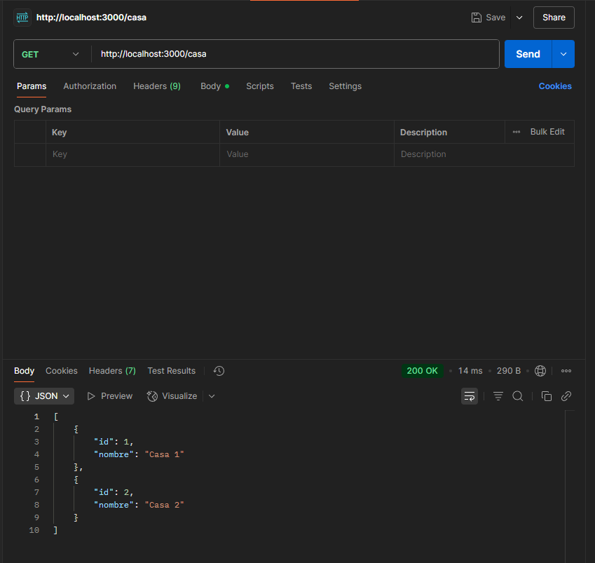
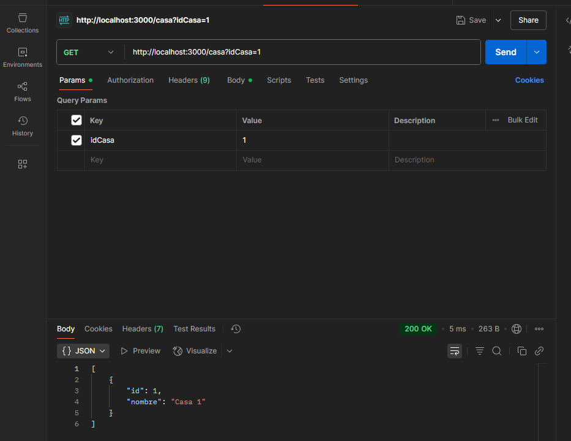
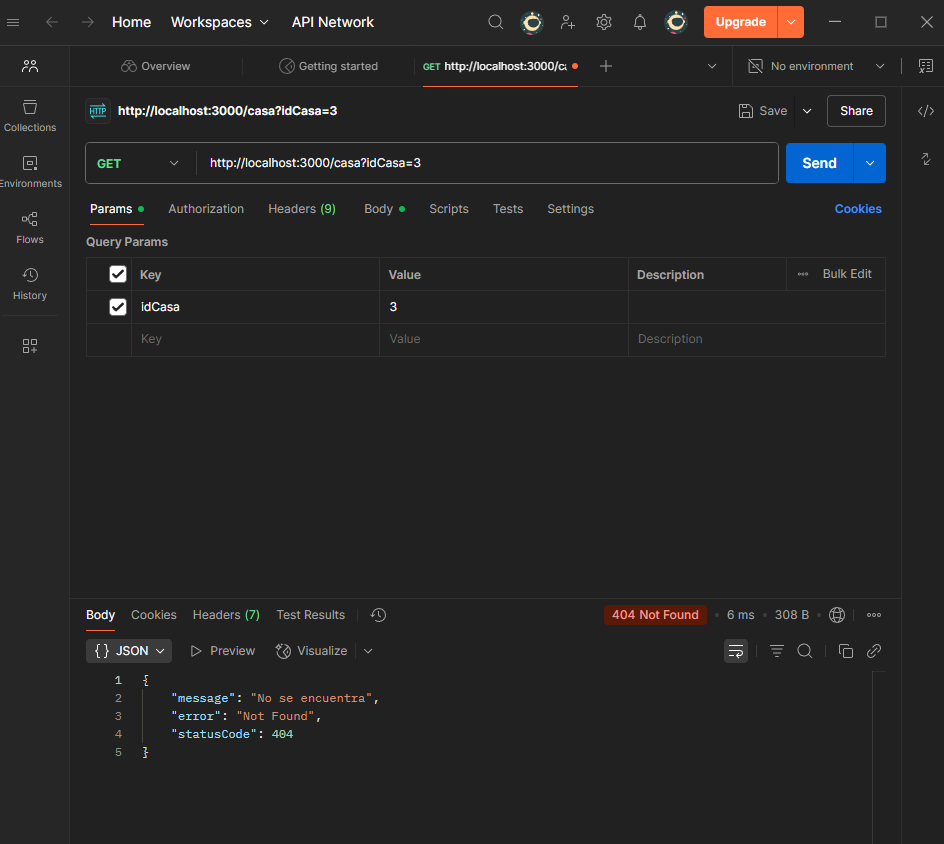

## Servicio REST - Examen 22 Junio 2025

Este proyecto implementa un servicio REST con **NestJS**, que permite consultar casas. Si se proporciona el parámetro `idCasa`, se devuelve solo la casa correspondiente. Si no se encuentra, se retorna un error 404.  
> El módulo de lógica (`CasaService` y `CasaController`) está contenido en una carpeta **fuera del `src/`**, llamada `Examen-FernandoAldaz`.

---

##  Estructura del Proyecto

00-SERVIDOR-WEB/
├── Examen-FernandoAldaz/
│ ├── casa.service.ts
│ └── casa.controller.ts
├── src/
│ └── main.ts
│ └── app.module.ts
├── package.json
├── tsconfig.json
└── README.md

---

## Tecnologías Utilizadas

- Node.js
- NestJS
- TypeScript

## Implementacion

Primero cree las siguientes clases:

### CasaService

```typescript
import { Injectable } from '@nestjs/common';

@Injectable()
export class CasaService {
  private casas = [
    { id: 1, nombre: 'Casa 1' },
    { id: 2, nombre: 'Casa 2' },
  ];

  findAll() {
    return this.casas;
  }

  findById(id: number) {
    return this.casas.find(c => c.id === id);
  }
}
```

### CasaController

```typescript
import { Controller, Get, Query, NotFoundException } from '@nestjs/common';
import { CasaService } from '../Examen-FernandoAldaz/casa.service';

@Controller('casa')
export class CasaController {
  constructor(private readonly casaService: CasaService) {}

  @Get()
  getCasa(@Query('idCasa') idCasa: string) {
    if (idCasa) {
      const id = parseInt(idCasa);
      const casa = this.casaService.findById(id);
      if (!casa) {
        throw new NotFoundException('No se encuentra');
      }
      return [casa];
    }
    return this.casaService.findAll();
  }
}
```

Luego se registo en la clase app.module:

```typescript
import { Module } from '@nestjs/common';
import { AppController } from './app.controller';
import { AppService } from './app.service';
import { CasaController } from '../Examen-FernandoAldaz/casa.controller';
import { CasaService } from '../Examen-FernandoAldaz/casa.service'; 

@Module({
  imports: [],
  controllers: [AppController, CasaController],
  providers: [AppService, CasaService],
})
export class AppModule {}
```
---

## Casos de prueba

- Primer caso de prueba, obtener todas las casas:

GET http://localhost:3000/casa



- Segundo caso de prueba, obtener casa por ID:

GET http://localhost:3000/casa?idCasa=1



- Tercer caso de prueba, casa no encontrada:

GET http://localhost:3000/casa?idCasa=3

